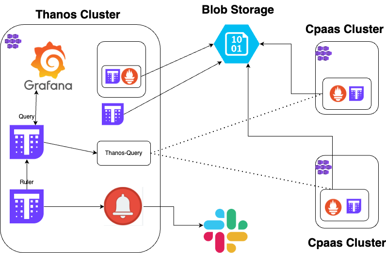

This project was made with the idea to centralize the monitoring of several kubernetes clusters. 
I have made some changes to the kube-prom deployment to add a persistent volume to Grafana to avoid losing any dashboards 
and Ill be adding a way to sso into grafana using Azure AD(entra id)

The project contains three directories which include both the terraform code, kube-prometheus-stack and thanos configuration files meant to be deployed on a Kubernetes cluster with either ArgoCD or manually. 
The terraform code creates and AKS cluster with predifined settings.
The prometheus configuration have been made to deploy all of the kube-prometheus-stack with a grafana accessible using AzureAD
The configuration are made for a production environment and the ruler is set to read the ruler.yml file.

